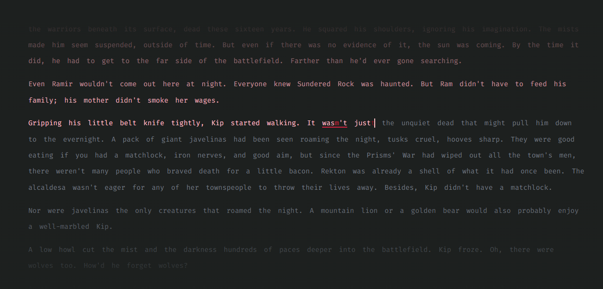

# Typey Boi

<p align="center">
  
</p>

Practice typing by reading a book.

Built with:

- Typescript
- React
- Redux
- Styled-components
- Parcel
- Electron

Style-checking:

- Prettier
- Eslint
- Stylelint

## Usage

## Download

Download typey-boi.exe from the [latest release](https://github.com/Meebuhs/typey-boi/releases)

Text is then loaded from a text file; [Calibre](https://calibre-ebook.com/) can be used to convert your ebooks to .txt.

It's a good idea to delete all the front matter from the start of the text file, typing out a table of contents isn't the most interesting thing in the world.

## Development

```
git clone https://github.com/Meebuhs/typey-boi
cd typey-boi
yarn
```

### Yarn commands

| Command         | Description                                     |
| --------------- | ----------------------------------------------- |
| `yarn build`    | Packages a production build of this extension.  |
| `yarn dev`      | Starts a local development server on port 1234. |
| `yarn lint`     | Runs eslint and stylelint.                      |
| `yarn prettier` | Perform in-place prettier reformat.             |
| `yarn precommit`| Runs lint and prettier.                         |
| `yarn dist`     | Compresses the current build for distribution.  |
| `yarn electron` | Starts electron.                                |
| `yarn dist`     | Packages a distribution build using electron.   |

## License

This project is released as open source under the [MIT License](https://opensource.org/licenses/MIT)
